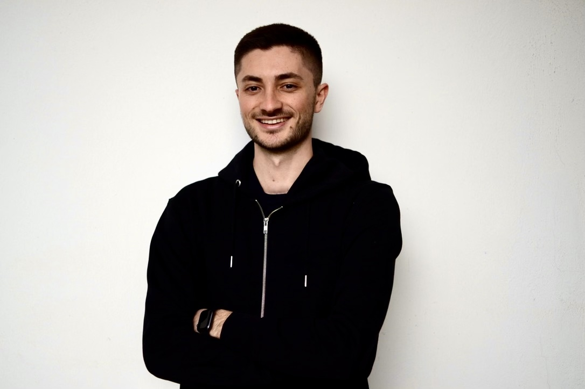

  
  
  # Stefano Zeppieri
  
  ### Software Engineer & PhD Student
  
  

    Software Engineer and Ph.D. Student at Sapienza University of Rome. Researching Large Language Models and Human-Computer Interaction. Passionate about creating intuitive, AI-driven web experiences.
  

  

    
    
  

 

## 🔬 Research & Publications

**Transforming Interactive Systems with Large Language Models: Accelerating Interface Design and Evaluation**  
*Conference Paper - Oct 2025*  
Exploring the impact of LLMs on HCI workflows and design acceleration.  
[Read on ResearchGate](https://www.researchgate.net/publication/395349052_Transforming_Interactive_Systems_with_Large_Language_Models_Accelerating_Interface_Design_and_Evaluation)

**Engineering Large Language Model Agents for Transforming Unstructured Descriptions into Structured Input**  
*Conference Paper - Jun 2025*  
Methodologies for converting unstructured data into structured formats using LLM agents.  
[Read on ResearchGate](https://www.researchgate.net/publication/395382219_Engineering_Large_Language_Model_Agents_for_Transforming_Unstructured_Descriptions_into_Structured_Input)

**Enhancing Interface Design with AI: An Exploratory Study on a ChatGPT-4-Based Tool for Cognitive Walkthrough Inspired Evaluations**  
*Conference Paper - Jun 2024*  
Cognitive walkthrough inspired evaluations using GPT-4 tools.  
[Read on ResearchGate](https://www.researchgate.net/publication/381119522_Enhancing_Interface_Design_with_AI_An_Exploratory_Study_on_a_ChatGPT-4-Based_Tool_for_Cognitive_Walkthrough_Inspired_Evaluations)

 

  

 

## 🛠 Tech Stack

### Languages

### Tools & Platforms

 

## 🌐 Connect

  
  
  

